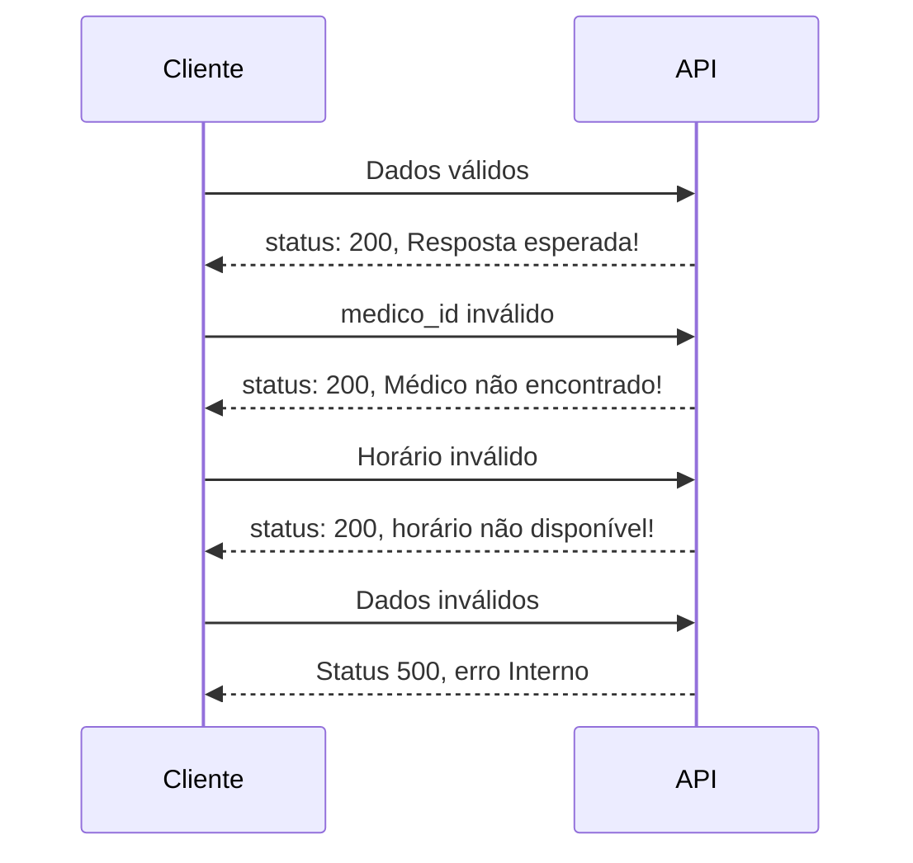

### Teste Técnico - Desenvolvedor Backend - Leve Saúde

Responsável: **Matheus Lima Ferreira**

email: mtsgosk8@gmail.com

Github: https://github.com/matheusgosk8

---

#Observações

```
Versão do serverless framework : V4
Gerênciador de pacotes: npm
Versão do node.js: v22.0.0

#Estrutura geral
Seguindo as recomendações do teste.
```

```
src
├── __tests__   # Pasta dos testes do jest
├── agenda
│   ├── controller
      └── agenda.ts
│   ├── dto
│   ├── interface
│   ├── mocks
      └── medicos.json
│   ├── service
│   └── types   # Pasta onde são colocados os types utilizados nesta rota
├── agendamento
    ├── controller
      └── agendamento.ts
    ├── dto
    ├── interface
    ├── mocks
      └── agendamento.json
    ├── service
    └── types
└── utils
    ├── getAgendamentos.ts
    └── getAgendas.ts

```

## Iniciando o projeto

Todos os scripts de inicialização foram escritos no arquivo "package.json"

-> Instalando pacotes e dependências

`$ npm i`

-> Dev

`$ npm run dev`

Roda a build em modo de desenvolvimento, utilizando o plugin "serverless offline", inicia as funções no porte 3000.

**http://localhost:3000/dev/api/agenda**
Rota de get com as informações dos médicos e horários disponíveis.

**http://localhost:3000/dev/api/agendamento**
Rota de post para o agendamento de consultas.

# Testes

Testes utilizando o "jest", todos os arquivos de teste estão localizados na pasta de **testes**.

##Teste geral
Script que roda todos os arquivos de testes, colocando os resultados no output do terminal.

`$ npm run test`

## Teste monitoramento

Roda os testes em modo de monitoramento.

`$ npm run test:watch`

## Teste coverage

Roda os testes em modo de detalhamento

`$npm run test:coverge`

## Estrutura dos testes

Os testes unitários foram separados em dois tipos, para "agenda" é realizado um fetch na url da função de get, para o agendamento é utilizado uma função própria que busca no arquivo medicos.json, retornando multiplos resultados de acordo com os parâmetros da função.

### Agenda

Teste para a rota de get da agenda.
**src/utils/getAgenda.ts**

Sucesso -> Qualquer retorno não nulo.

Falha -> Retorno null do catch da função de fetch.

### Agendamento

Teste para a rota de post do agendamento.

**src/utils/getAgendamentos.ts**

Ao invês de testar a função lambda em sí, aqui foi testado uma função específica utilizada para determinar os resultados da tentativa de agendamento:


